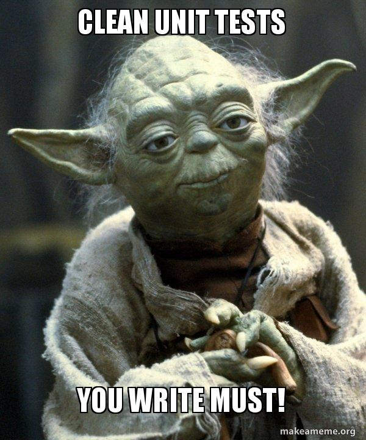

```{r setup, include=FALSE}
# ioslides_presentation slidy_presentation
knitr::opts_chunk$set(echo = FALSE)
library(dplyr)
```

# Not a smooth ride

## Questions!

- questions are everything!

## This is a Pilot

- Stuff will go wrong
- I need your feedback
- No one in the humanitarian system has (successfully) done this before

# General Strategy {data-background="background.svg"}

## Data Unit Strategy: {data-background="background.svg"}

- More work => Deeper Analysis
- More work => Fewer Errors
- More work => Less Work


## Components {data-background="background.svg"}

- Culture
- **Capacity**
- Processes
- Sustainable Change

# Data Unit capacity building framework {data-background="background.svg"}

##   {data-background="background.svg"}
##  {data-background="background.svg"}
##  {data-background="background.svg"}
##  {data-background="background.svg"}
##  {data-background="background.svg"}

# Learning Goals {data-background="background.svg"}

## NOT the learning Goals {data-background="background.svg"}

- *Not* a training on specific tools
- *Not* a data science degree in 2 days
    - (not statistics)
    - (not generic R)
    - (not quantitative research methods)


# What it means to be an R-Mentor

- You are able to explain the workings of the core IMPACT R packages to yourself  
  - Advanced debugging  
  - Raising issues on GitHub  
  - Collaboration and good software design practices
- You are able to explain the workings of the core IMPACT R packages to others  
  - Teaching  
  - Support  

# R-Users

## R-User skills summary
&nbsp;  
&nbsp;  
- Loading packages  
- Reading documentation  
- Executing functions   
- Vers basic debugging (reading and googling error messages)  

## trainer training
&nbsp;  
&nbsp;  
&nbsp;  
&nbsp;  
- Getting people fro 0 to that point
- Realise how much you already know (starting with console)

## Setting up Version Control for your project
&nbsp;  
&nbsp;  
&nbsp;  
&nbsp; 
- GitHub  
- Forking vs. Branching   
  - Make a fork for the hypegrammaR package, from the training branch and pull  
  - Raise an issue  

## Valuable commit messages (i.e. not what Eliora does) 
##  {data-background="background.svg"}

# Portable Code / Projects

## R environments overview 

    List at least three ways that an environment is different to a list.

    What is the enclosing environment of a function? Why is it important?

    How do you determine the environment from which a function was called?

    How are <- and <<- different?
    
## The rmarkdown environment     

BASICALLY
Rmarkdown knits into its own funky fresh environment 

## R environments answers

    There are four ways: every object in an environment must have a name; order doesn’t matter; environments have parents; environments have reference semantics.

    The parent of the global environment is the last package that you loaded. The only environment that doesn’t have a parent is the empty environment.

    The enclosing environment of a function is the environment where it was created. It determines where a function looks for variables.

    Use parent.frame().

    <- always creates a binding in the current environment; <<- rebinds an existing name in a parent of the current environment.


# Debugging

## Debugging techniques

- Russian dolls 
##  {data-background="background.svg"}


## Debugging techniques: 
There is an issue with the way hypothesis_test_chisq behaves. But you don't know that yet
But you don't know that yet 

## Debugging techniques

- Manual debugging
  - Loops are hard to debug: Assign intermediate steps to an object 
  - Print variable name 
  - Reduce to inputs a list of two elements 
  
- install.packages("debug")
library(debug)  
  
## Debugging techniques  
  
- Debug - > On error -> Error inspector / Break in code

## Debugging techniques
- Generating fake inputs
    - Have the code for this readily available
    

```{r fake_code, eval = T}
testdf<- data.frame(
  letters_sm = sapply(1:12,function(x){letters[x:1] %>% paste(collapse=" ")}),
  letters_sm_facts = as.factor(sapply(12:1,function(x){letters[x:1] %>% paste(collapse=" ")})),
  theletters=letters[1:12],ints_1_12 = 1:12, ints_1_6 = c(1:6,1:6),chars_1_12 = as.character(c(12:1)),
  facs_12_1 = as.factor(as.character(c(12:1))),stringsAsFactors = F)


testdf %>% head
```

## Debugging techniques: Common bugs

  - [List][https://docs.google.com/document/d/1KX_lwlagsn3kd5a1DCsdcle69kUTBoHWD4tyMHHMnjo/edit?usp=drive_web&ouid=108086624168702718242]
  - Look on stackoverflow
  - Raise the issue

## Debugging in R markdown

Debugging only works with the primary R process, so when rendering the document for debugging, you’ll need to ensure it renders there.

To do this, call rmarkdown::render() directly on your file:
```{r 2, eval = F}
rmarkdown::render("~/mydocs/doc.Rmd") 
```

When the interactive debugger shows up in the console, it will not print user output. If you want  to see output in the console, you should use sink(). 

```{r 3, eval = F}
Browse[1]> sink()
```


## Common Error Messages and what they mean

# Modern R

## Tidyverse

[Tidy Data][https://r4ds.had.co.nz/tidy-data.html]

- Packages in the tidyverse

[dplyr][https://dplyr.tidyverse.org/]
[tibble][https://tibble.tidyverse.org/]
[ggplot2][https://ggplot2.tidyverse.org/]
[purrr][https://purr.tidyverse.org/]

## Apply / purrr
&nbsp;  
&nbsp;  
- Loops = Bad 
- Apply is vectorised 

# Software Design: Functions

## Writing functions with tests
&nbsp;  
&nbsp;  
##   {data-background="background.svg"}

## Writing functions with tests
&nbsp;  
&nbsp;  
Why do we write tests before we write our code ? 

## Writing functions with tests
&nbsp;  
&nbsp;  
Pull the latest hypegrammaR, and add tests for the map_to_summary_table function


## pure functions

[Pure Functions](https://dev.to/chrisvasqm/explain-pure-functions-like-im-five-26o6)

## Decoupling and Cohesion


## Good function names

[Coding like shakespeare](https://dmitripavlutin.com/coding-like-shakespeare-practical-function-naming-conventions/)

# Good Practice

## Why write "good" code?

Code needs to *work*  

When code is easy to understand, we can change or extend it faster and are less likely to make a mistake in the process. Readability counts.  

When code is easy to change, we can iterate on user feedback faster.  

When code is fun to work with, we're happier. Building software is our full time job. If we go home every day feeling wrung dry, something is wrong with our process.  

## Naming things
## Documentation
## DRY design

# Contributing to R packages
## Reading Package Source Code
## Do's and don'ts for packages source code

- pure functions only
- forbidden:
    - `source()`
    - `library()`
    - `require()`
- roxygen documentation

## Collaborating on GitHub: talk - fork - clone - edit - pull request


